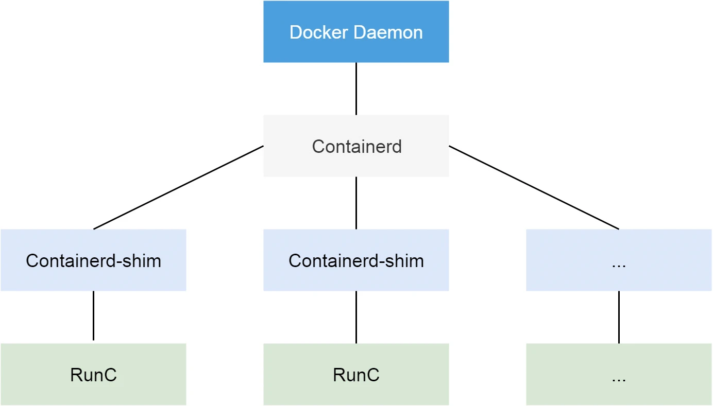
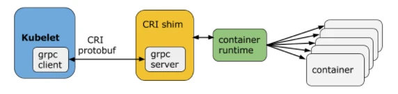
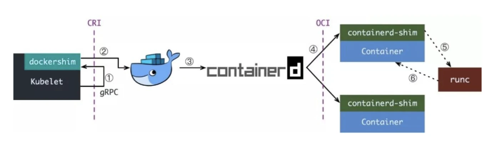
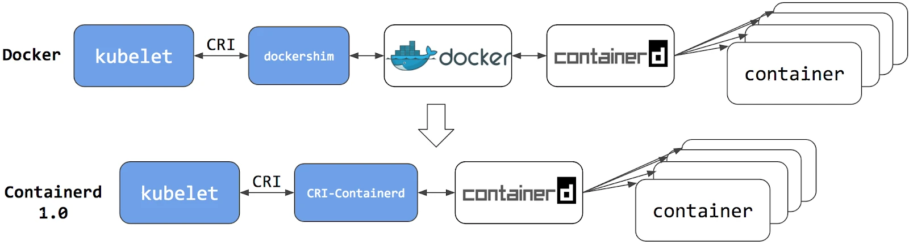
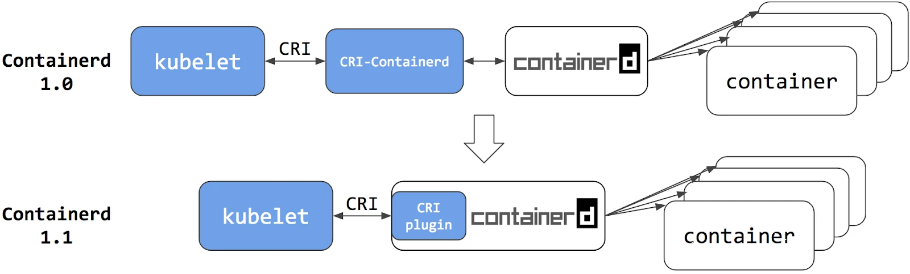
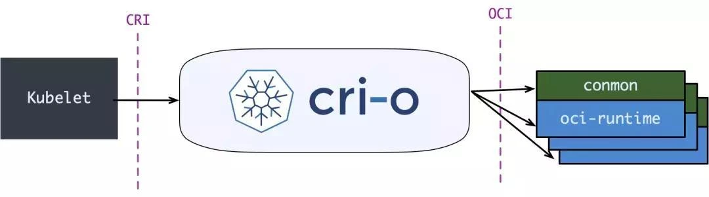

# Containerd

## Introduction

Containerd is an industry-standard container runtime that manages the complete container lifecycle on a host system — from image transfer and storage to container execution, supervision, and networking.

> Reference:
>
> 1. [Official Website](https://containerd.io/docs/)
> 2. [Repository](https://github.com/containerd/containerd)
